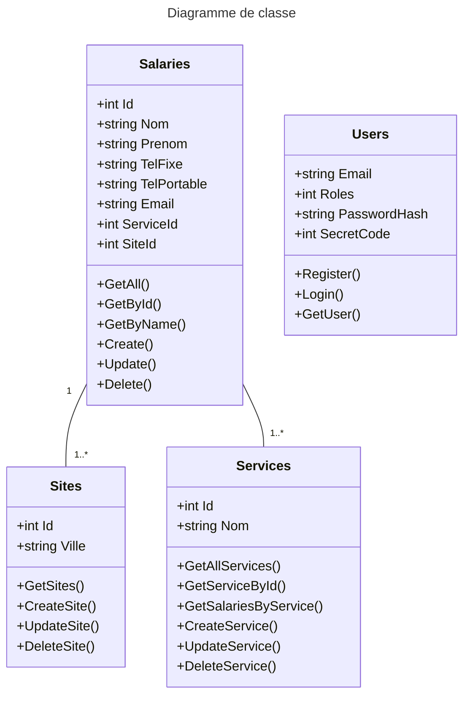

```mermaid
---

title: Diagramme de classe
---
classDiagram
    class Salaries{
        +int Id
        +string Nom
        +string Prenom
        +string TelFixe
        +string TelPortable
        +string Email
        +int ServiceId
        +int SiteId
        +GetAll()
        +GetById()
        +GetByName()
        +Create()
        +Update()
        +Delete()
    }
    Salaries "1" -- "1..*" Sites
    class Sites{
        +int Id
        +string Ville
        +GetSites()
        +CreateSite()
        +UpdateSite()
        +DeleteSite()
    }
    Salaries "1" -- "1..*" Services
    class Services{
        +int Id
        +string Nom
        +GetAllServices()
        +GetServiceById()
        +GetSalariesByService()
        +CreateService()
        +UpdateService()
        +DeleteService()
    }
    class Users{
        +string Email
        +int Roles
        +string PasswordHash
        +int SecretCode
        +Register()
        +Login()
        +GetUser()
    }
   

```